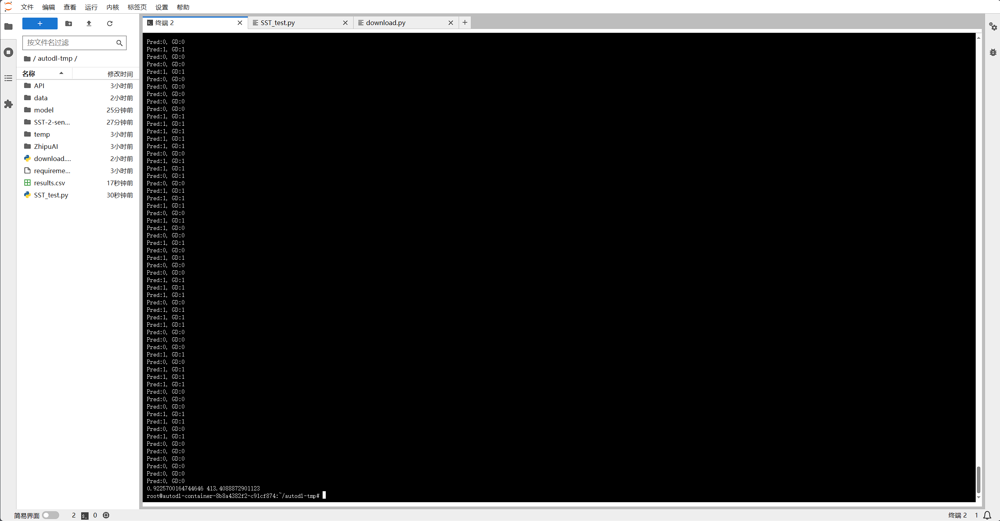
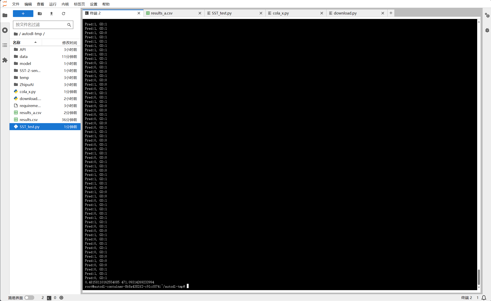
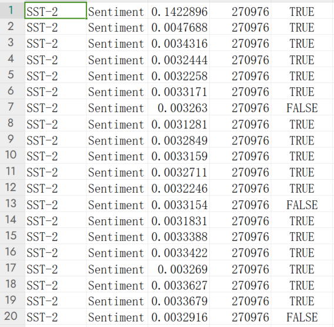
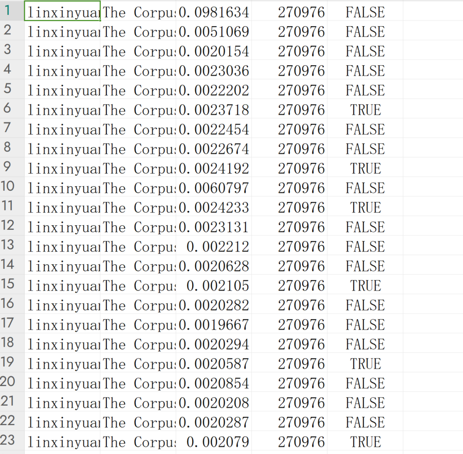
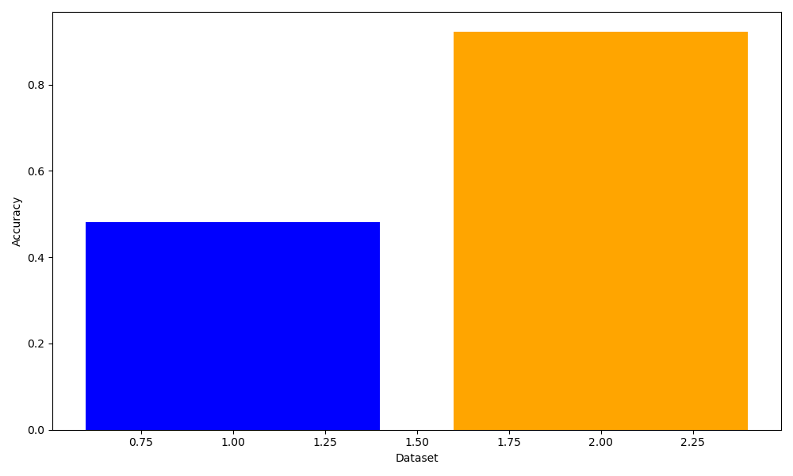
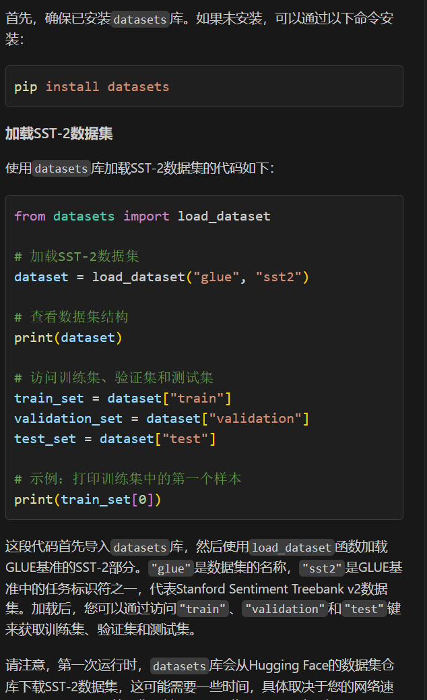
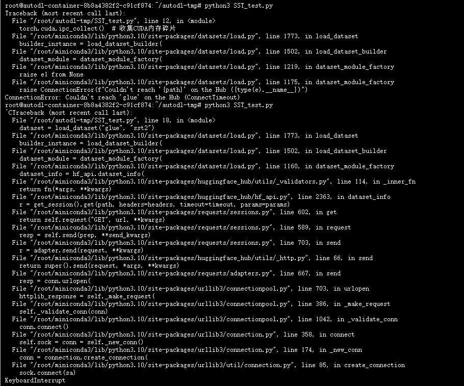
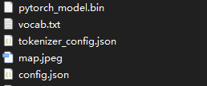

# LLM部署

## I.开源大语言模型的安装和配置过程


部署平台为autodl上的4090D 24G显存机器
环境为ubuntu22.04  pytorch2.10 cuda 12.1

### 配置环境过程：

根据教程
编写下requirements.txt如下

```
fastapi==0.104.1
uvicorn==0.24.0.post1
requests==2.25.1
modelscope==1.9.5
transformers==4.35.2
streamlit==1.24.0
sentencepiece==0.1.99
accelerate==0.24.1
transformers_stream_generator==0.0.4
xformers==0.0.23
```

在命令行中依次输入以下命令

```shell
python -m pip install --upgrade pip
# 升级pip
pip config set global.index-url https://pypi.tuna.tsinghua.edu.cn/simple
# pip换源
pip install -r requirements.txt
```


### 模型下载：

在[distilbert/distilbert-base-uncased-finetuned-sst-2-english · Hugging Face](https://huggingface.co/distilbert/distilbert-base-uncased-finetuned-sst-2-english)网站下直接找到Files and versions，下载文件config.json,

map.jpeg, model.safetensors, pytorch_model.bin, tokenizer_config.json, vocab.txt，然后统一移动到命名为model的文件夹下，然后使用如下代码导入模型

```python
tokenizer = DistilBertTokenizer.from_pretrained("model")
model = DistilBertForSequenceClassification.from_pretrained("model")
```

## II.模型的性能测试

本次选择的是distilbert在sst-2数据集上微调过的模型，先是在sst-2的数据集上测试
选择的是sst-2的测试集，test.tsv
单位时间的吞吐量为413.4088872901123
在整个测试集上的准确率为0.9225700164744646


在cola数据集上进行对句子是否合乎语法的判断
因为这次选择的模型是在sst-2数据集上微调过，故在cola数据集上表现不是很好


### 测试步骤：

1.编写测试代码：
读取数据集csv文件，col1是label， col2是text
将所有的label和text转为列表，在for循环中迭代，
先使用tokenizer处理text再传给模型进行推理
推理不需要梯度数据去进行反向传播更新参数，故outputs = model(**inputs)需要在 with torch.no_grad()下运行

2.运行测试代码，将推理一个数据的时间，以及推理结果是否准确，还有GPU的资源占用存在列表中


## III:实验数据

使用pandas库进行数据收集
将存储在列表中的数据写入csv文件

```python
with open(out_file_path, mode="w", newline="") as file:
    writer = csv.writer(file)
    for info in info_write:
        writer.writerow(info)
```

SST-2数据集


COLA数据集


## IV:实验数据的可视化

使用matplotlib和pandas库
读取保存的结果csv文件，计算出平均推理时间和正确率，画出直方图并保存



## V:遇到的问题及解决方案

#### 1.不知道如何加载SST-2数据集

询问Copilot


#### 2.transformers库不知道如何使用

解决方法：查看官方API文档
链接:[[Auto Classes (huggingface.co)](https://huggingface.co/docs/transformers/quantization/overview)](https://transformers-doc.100sta.com/docs/transformers/v4.31.0/zh/preprocessing)
在后续中，DistilBertTokenizer，DistilBertForSequenceClassification函数参数解析以及使用方法也是通过查看官方文档得到帮助




#### 3.使用datasets.load_dataset无法加载SST-2数据集


解决方法：
查看Huggingface官方datasets的文档
中断python进程，显示正在链接huggingface，可能是网络问题导致无法访问数据集
在github上找到SST-2数据集，然后git clone下来，找到data文件夹

```python
data_path = 'data/test.csv'
df = pd.read_csv(data_path, delimiter='\t', header=None, names['lable', 'text'])
```

[YJiangcm/SST-2-sentiment-analysis: Use BiLSTM_attention, BERT, ALBERT, RoBERTa, XLNet model to classify the SST-2 data set based on pytorch (github.com)](https://github.com/YJiangcm/SST-2-sentiment-analysis)

#### 4.数据可视化问题：

使用plt.bar画柱状图的时候，本应当是生成两个柱，但是不同颜色的柱叠在一起的
原因：

```python
plt.bar(1, values, color='blue', label='Inference Time')
plt.bar(1, values2, bottom=values, color='orange', label='Inference Time')
# bottom=values 而bottom: 条形的起始位置，默认是从 0 开始。可以通过调整这个参数来改变条形的起始位置，用于堆叠条形图等
# 删除bottom即可正常绘制
# 且第一个参数应设置为不同的两个值
```

#### 5.环境问题：

安装环境的时候，使用pip install下载速度过慢
解决方法：pip换源为清华源

## VI:无法解决的问题及其分析

### 模型下载问题：

##### 方式1：

```python
from transformers import AutoTokenizer, AutoModelForSequenceClassification

tokenizer = AutoTokenizer.from_pretrained("distilbert/distilbert-base-uncased-finetuned-sst-2-english")
model = AutoModelForSequenceClassification.from_pretrained("distilbert/distilbert-base-uncased-finetuned-sst-2-english")
```

distilbert-base-uncased-finetuned-sst-2-english无法通过这个方式直接下载使用，因为无法直接链接到网站

##### 方式2：

```shell
git lfs install
git clone https://huggingface.co/distilbert-base-uncased-finetuned-sst-2-english
```

链接超时无法下载


### 数据集问题：

使用load_dataset()加载数据，一直卡在加载数据集这里，可能原因为无法链接到huggingface的网站

